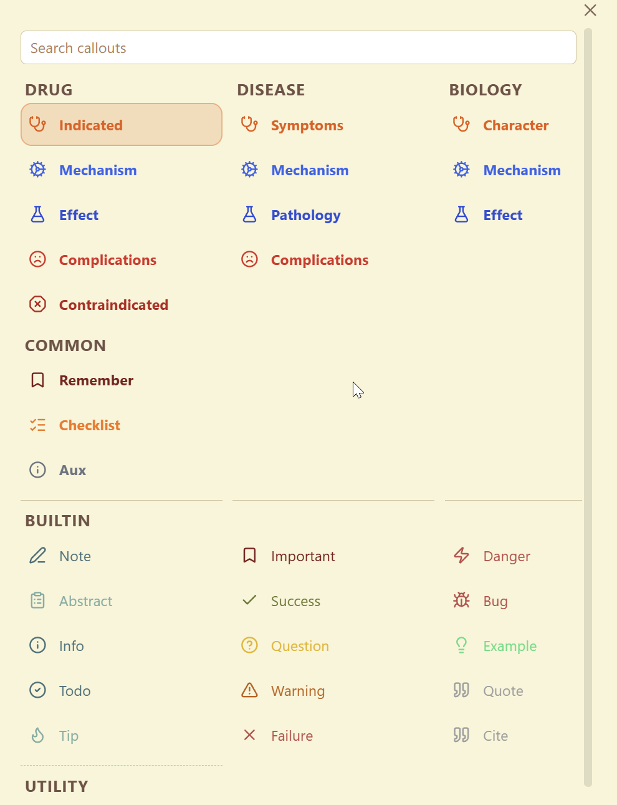

# Cluddle Callouts

Cluddle Callouts is an Obsidian plugin that makes callouts easier to insert, switch, and discover while editing notes.

It adds a searchable callout picker to the editor right-click menu and provides a command to open the same picker from Obsidian. The picker includes Obsidian's built-in callouts and also detects custom callouts defined by your enabled CSS snippets.

## Example



## What The Plugin Does

- Inserts a new callout at the cursor
- Wraps the current selection in a callout
- Changes the type of an existing callout in place
- Removes a callout from the current block
- Lets you search across built-in and custom callouts from one picker
- Prefers custom callouts in search results when that setting is enabled

## How To Use It

1. Open a note in Obsidian.
2. Right-click in the editor and choose the callout action, or run the `Open callout picker` command.
3. Search for the callout you want.
4. Use `ArrowUp`, `ArrowDown`, `ArrowLeft`, and `ArrowRight` to move around the picker if needed.
5. Press `Enter` to apply the selected result, or click an item directly.

If your cursor is already inside a callout, the picker acts as a "change callout type" tool and also exposes a remove action from the editor context menu.

## Custom Callouts

The plugin reads enabled CSS snippets from your vault's Obsidian config and looks for `.callout[data-callout="..."]` definitions. That means custom callouts can show up in the picker automatically without requiring a separate plugin-specific registry.

Here is a full example of a CSS snippet entry that this plugin can process:

```css
.callout[data-callout="indicated"],
.callout[data-callout="recommended"] {
  --callout-color: 230, 126, 34;
  --callout-concept: drug-usage;
  --callout-groups: drug disease;
  --callout-group-drug: indicated;
  --callout-group-disease: symptoms;
}
```

With that snippet enabled in Obsidian:

- `indicated` is treated as the primary callout id
- `recommended` is treated as an alias for the same callout
- the callout appears in the picker under the `drug` group as `Indicated`
- the same underlying callout also appears under the `disease` group as `Symptoms`
- the picker inherits the CSS callout color automatically

You can define additional groups with more `--callout-group-<group-name>` properties. The alias list for each group is whitespace- or comma-separated, and the first alias becomes the displayed picker entry for that group.

## Settings

The plugin includes settings for:

- Maximum rows per picker column
- Total picker columns
- Picker width
- Picker height
- Whether custom callouts should rank above built-in ones in search

## Disclosures

- Desktop only
- No network access
- No accounts, payments, ads, or telemetry
- Reads `.obsidian/appearance.json` and enabled CSS snippet files from `.obsidian/snippets/` to discover custom callout definitions
- Stores only its own settings in Obsidian's plugin data store
- Does not write to notes unless you choose a callout from the picker

## What Ships

The plugin artifact loaded by Obsidian is:

- `manifest.json`
- `main.js`
- `styles.css`

## Development

Source files live under `src/`. Build the runtime plugin artifact with:

```bash
npm install
npm run build
```

That bundles the source tree into the shipped `main.js` at the repository root.

## Notes

- Release assets for Obsidian should contain only `manifest.json`, `main.js`, and `styles.css`
- Desktop only
- No network access
- Reads local Obsidian appearance settings and enabled CSS snippets from the vault config directory
